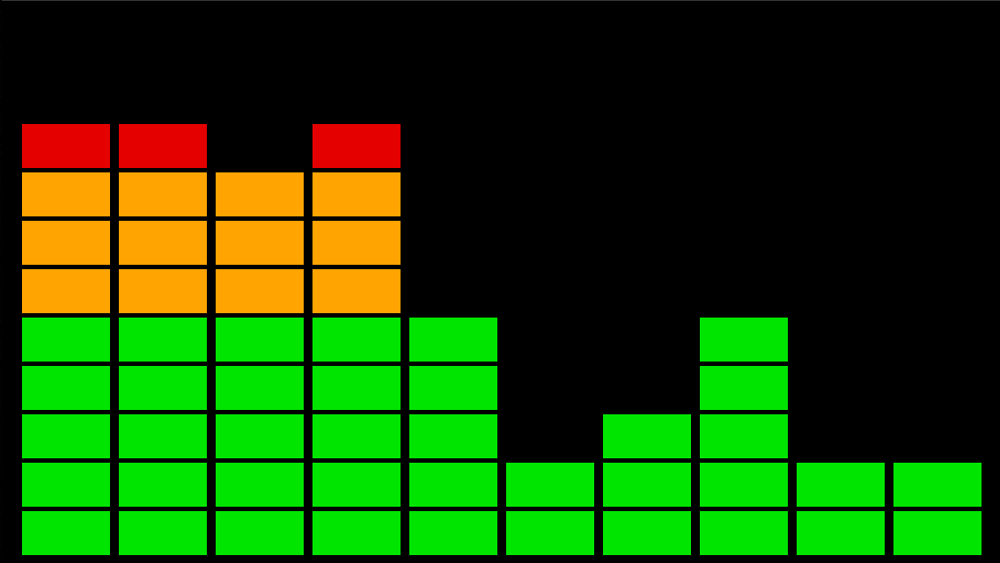

## EQ: Visualize a stereo graphic equalizer.

### Usage

With [LÖVE](https://love2d.org/) 11.3:

```sh
love .
```




### Understanding the Visualization

The name `EQ` refers to an "equalizer", visualizing the audio spectrum in a
style similar to stereo receivers. While a stereo set shows this visualization,
in part, to allow the listener to adjust gain in different bands, the `EQ`
project here is just a visualizer and does not adjust gain as an equalizer
does.

Using the system microphone, `EQ` displays the audio frequency content in
"bins" like a histogram. Each of the 10 bins displayed visualizes a fixed
frequency band. This band is configured by constants in main.lua:

* `SAMPLE_RATE`, as supported by the sound card, determines the frequency value
  of Fourier transform. The result has a fundamental frequency of `SAMPLE_RATE
  / BINS` (see below).
* Due to the limit of frequencies detectable by sampling, i.e. the Nyquist
  limit, the theoretical range of frequencies is 0 to `SAMPLE_RATE / 2`.

The constants in main.lua result in a bin frequency bandwidth of 918.75Hz per
bin, called the "fundamental frequency." The first bin on the left shows low
frequencies up to 918.75Hz, and the next bin is those up to 1,837.50Hz. The bin
after that has frequencies up to 2,756.25, and so on, with the bin on the right
being 10x the fundamental frequency, or 9,187.50Hz.

The magnitude displayed by each bin, the number of blocks stacked high, is set
with a sensitivity controlled by the `BIN_CUTOFF` constant in main.lua, with
lower values being more sensitive. This value is set based on the intended
demonstration of the visualization, to show changing magnitudes of frequency
content for the expected audio input.


### Signal Processing

This project includes its own Lua implementations of the [discrete Fourier
transform][DFT] and [signal window functions][Hann]. A custom implementation
serves both to eliminate project dependencies -- that of an external Fast
Fourier Transform (FFT) library -- and to demonstrate how these algorithms
work. The implementations in [dft.lua](./dft.lua) are faithful digital signal
processing algorithms, but the project makes some optimizations toward the goal
of a simple visualization:

* The `dft.transform` implementation assumes real-only valued input (because
  that's true for audio) and does not include an inverse transform.
* The `dft.transform` implementation supports discarding bins that would
  otherwise not get visualized, namely the 0Hz DC bin and all bins above the
  Nyquist limit.

Altogether, the project serves as one of education and demonstration, not a
professional tool for audio applications.

[DFT]: https://en.wikipedia.org/wiki/Discrete_Fourier_transform
[Hann]: https://en.wikipedia.org/wiki/Window_function#Hann_and_Hamming_windows
